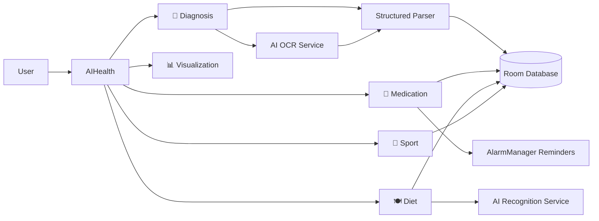

<div align="center">

# 🏆 AI健康管家 · AIHealth

**All-in-One AI-Powered Health Management**

[中文](README.md) · [**English**](README.en.md) · [日本語](README.ja.md)

---

[](#)


</div>

---

> 🏅 **National Award Project of the China Robot & Artificial Intelligence Competition** — a competition-grade AI application built for real-world health management.

**AIHealth** is an all-in-one Android health management platform powered by AI. It turns fragmented medical records, medication schedules, dietary intake, and workout plans into a smooth, native experience — so health management is visible, actionable, and measurable.

## ✨ Highlights

| Highlight | Description |
| --- | --- |
| 🏆 Competition-grade | **National Award Project of the China Robot & Artificial Intelligence Competition** |
| 🤖 Full AI pipeline | Unified AI calling interface (OCR + dish recognition) + structured parsing: image in, structured health data out |
| 🧩 Five core modules | Diagnosis, medication, diet, sport, visualization — full-scenario coverage |
| 🔒 Data stays local | Room database + on-device accounts; privacy by design |
| ⚡ Lightweight & fast | Pure Java + mainstream open-source components, easy to maintain |

## 🧩 Core Features

| Module | Capabilities |
| --- | --- |
| 📄 **Smart Diagnosis Sheet Recognition** | Photo/gallery input → AI OCR → auto-extract diagnosis, medical advice, allergy alerts & key indicators (BP, glucose, heart rate, BMI…); history filtering, quick stats, image preview |
| 💊 **Full-Cycle Medication Management** | Add drugs, daily frequency, multi-slot reminders; taken/pending status; batch edit; AlarmManager reminders restored after reboot |
| 🍽️ **Smart Diet Analysis** | Food photo → AI ingredient recognition → calorie & macro estimation (protein/fat/carbs); daily intake stats, history, result sharing |
| 🏃 **Personalized Sport Guidance** | 8+ sport types × intensity levels; generates tailored plans with safety advice based on duration & goals |
| 📊 **Health Data Visualization** | Bar/line/pie charts (MPAndroidChart); 7-day diagnosis & glucose trends; medication status distribution; health score, weekly/monthly reports, data export |
| 🔐 **Account System** | Local register/login, single unified database, persistent sessions |

## 🛠️ Architecture



### Tech Stack

| Category | Choice |
| --- | --- |
| Language | Java 11 |
| UI | Material Components, ConstraintLayout, DrawerLayout, BottomNavigationView, CardView |
| Storage | Room 2.6 (single database for user / diagnosis / drug / diet / sport) |
| Networking | OkHttp 4.12, Retrofit 2.9, Gson 2.10 |
| AI | Unified AI calling interface (OCR / image recognition; cloud-backed by default, provider-pluggable) |
| Charts | MPAndroidChart 3.1 |
| Reminders | AlarmManager (exact alarms) + BroadcastReceiver + notification channel (reboot-safe) |
| Images | Coil 2.5 |
| Build | Gradle (Kotlin DSL) + Wrapper + Version Catalog, AGP 8.13.0, compileSdk 36 |

## 📂 Project Structure

```text
AIHealth/
├── app/                            # Android application module
│   ├── libs/                       # Local dependencies (OCR SDK: ocrsdk.aar)
│   ├── schemas/                    # Exported Room schemas
│   └── src/main/
│       ├── java/com/aihealth/
│       │   ├── data/               # Data layer (single Room database + DAOs + entities + models)
│       │   │   ├── db/             # AppDatabase and type converters
│       │   │   ├── dao/            # Drug / diagnosis / diet / user DAOs
│       │   │   ├── entity/         # Room entities (Drug/Diagnosis/Diet/Sport/User)
│       │   │   └── model/          # Structured diagnosis, status counts, etc.
│       │   ├── network/            # Baidu AI service, food recognition wrapper
│       │   ├── receiver/           # Drug reminder broadcast receiver
│       │   ├── ui/                 # UI layer
│       │   │   ├── activity/       # Activities (login / main / camera / visualization)
│       │   │   ├── fragment/       # Five feature module screens
│       │   │   ├── adapter/        # RecyclerView adapters
│       │   │   ├── widget/         # Custom chart & health-score views
│       │   │   └── model/          # UI-layer data models
│       │   ├── util/               # OCR, diagnosis parser, permissions, image utils
│       │   └── AiHealthApplication.java   # Global Application
│       └── res/                    # Layouts / resources / themes / menus
├── gradle/                         # Version catalog & wrapper
├── build.gradle.kts                # Root build script
├── settings.gradle.kts             # Project settings
└── local.properties.example        # Local config template (sdk.dir / AI service keys)
```

## 🚀 Quick Start

### Prerequisites

- Android Studio (latest stable)
- JDK 17
- Android SDK 36 (minSdk 24 / targetSdk 36)

### Build

```bash
# 1. Clone the repository
git clone https://github.com/Universe0121/AIHealth.git
cd AIHealth

# 2. Copy the local config template
cp local.properties.example local.properties
```

Edit `local.properties` with your SDK path and AI service credentials:

```properties
sdk.dir=C:\\Users\\YourName\\AppData\\Local\\Android\\Sdk

# AI service credentials (currently backed by Baidu AI; swap the provider in code if needed)
BAIDU_API_KEY=your_baidu_api_key
BAIDU_SECRET_KEY=your_baidu_secret_key
```

Open the project root in Android Studio, or build from the command line:

```powershell
.\gradlew.bat assembleDebug
```

The APK is generated at `app/build/outputs/apk/debug/`.

## 🔑 AI Calling Interface Configuration

- **Unified entry**: the app calls a unified AI interface for OCR and image recognition; the underlying provider is pluggable and currently defaults to Baidu AI.
- **Diagnosis OCR**: text recognition through the AI interface (default: Baidu OCR SDK `app/libs/ocrsdk.aar`, AK/SK authorized).
- **Dish recognition**: ingredient recognition through the AI interface (default: Baidu AI dish recognition REST API, `aip.baidubce.com`).
- **Fallback**: if credentials are missing or recognition fails, built-in mock data keeps the demo flow running.

> ⚠️ `local.properties` is ignored by `.gitignore`. Never commit real credentials.

## 📌 Notes

- Build outputs, IDE state, local SDK paths, logs, APKs, and bundles are all git-ignored.
- All data lives in local Room databases; uninstalling or clearing app data will erase records.
- Medication reminders rely on AlarmManager; some OEM ROMs require enabling auto-start / background permission.
- No LICENSE is attached to this repository yet; all rights reserved by default. Contact the maintainer before commercial use.

## 🤝 Contributing

Issues and pull requests are welcome. Before submitting:

- Keep the code style consistent with the existing codebase
- Never commit local config, secrets, or build artifacts
- Document any new features

## 🙏 Acknowledgments

- **China Robot & Artificial Intelligence Competition** for the platform and guidance
- Baidu AI and other open AI platforms for OCR and image recognition capabilities
- All open-source dependency authors and communities

---

<div align="center">

Made with ❤️ · **National Award Project of the China Robot & Artificial Intelligence Competition** · [中文](README.md) · [日本語](README.ja.md)

</div>
