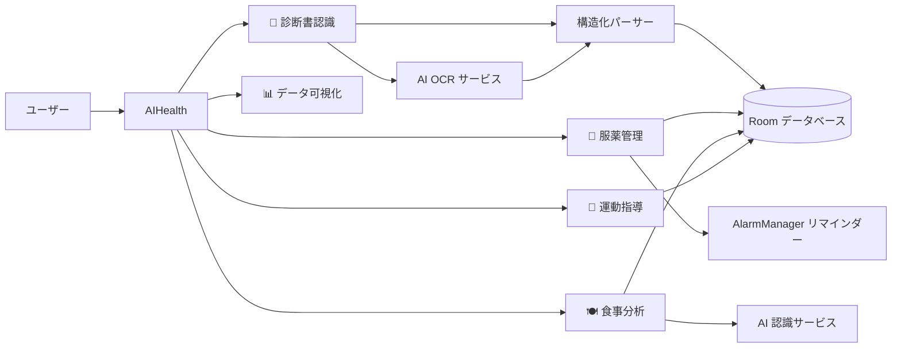

<div align="center">

# 🏆 AI健康管家（AIHealth）

**オールインワン AI 健康管理プラットフォーム**

[中文](README.md) · [English](README.en.md) · [**日本語**](README.ja.md)

---

[](#)


</div>

---

> 🏅 **中国ロボット及び人工知能コンテスト 国家賞プロジェクト** — 実際のヘルスケア現場向けに開発された、コンテスト級の AI 応用作品です。

**AIHealth（AI健康管家）** は、AI を核とし「記録 → 分析 → リマインド → アドバイス」の全プロセスをカバーする Android 健康管理アプリです。複雑な医療情報・服薬計画・食事摂取・運動プランを、シンプルなネイティブ体験に凝縮し、健康管理を「見える化・管理可能・フィードバック付き」にします。

## ✨ プロジェクトのハイライト

| ハイライト | 説明 |
| --- | --- |
| 🏆 コンテスト級の品質 | **中国ロボット及び人工知能コンテスト国家賞プロジェクト**。AI をヘルスケア現場に応用した代表作 |
| 🤖 AI 全工程への統合 | 統一 AI 呼び出しインターフェース（OCR + 料理認識）+ 構造化解析で、画像から構造化データをワンストップ生成 |
| 🧩 5 大コアモジュール | 診断・服薬・食事・運動・可視化。健康管理の全シーンをカバー |
| 🔒 データは端末内に保持 | Room データベース + ローカルアカウント。健康データは端末外に出ません |
| ⚡ 軽量・高速 | Java ネイティブ + 主要 OSS コンポーネント。重いフレームワークに依存せず、起動が速く保守もしやすい |

## 🧩 コア機能

| モジュール | 主な機能 |
| --- | --- |
| 📄 **診断書スマート認識** | 撮影/アルバムから取り込み → AI OCR で認識 → 診断結果・医師の指示・アレルギー情報・主要指標（血圧、血糖、心拍数、BMI など）を自動抽出。履歴の絞り込み、クイック統計、画像プレビューに対応 |
| 💊 **服薬ライフサイクル管理** | 薬剤登録、1 日あたりの回数、複数時間帯の服薬リマインダー。服用済み/未服用ステータス、一括編集。AlarmManager による通知は再起動後も自動復元 |
| 🍽️ **食事スマート分析** | 料理写真 → AI で食材認識 → カロリー・タンパク質/脂質/炭水化物などの栄養を推定。本日の摂取統計、履歴、結果の共有に対応 |
| 🏃 **パーソナライズ運動指導** | 8 種以上の運動 × 多段階の強度。時間と目標（減量/筋トレ/健康維持）に応じた個別プランと安全上の注意を生成 |
| 📊 **健康データ可視化** | MPAndroidChart による棒/折れ線/円グラフ。直近 7 日間の診断・血糖トレンド、服薬ステータス分布、健康総合スコア、週/月レポート、データエクスポート |
| 🔐 **アカウントシステム** | ローカル登録/ログイン、マルチデータベース分離（ユーザー/健康/食事）、セッション永続化 |

## 🛠️ アーキテクチャ



### 技術スタック

| カテゴリ | 技術 |
| --- | --- |
| 開発言語 | Java 11 |
| UI フレームワーク | Material Components、ConstraintLayout、DrawerLayout、BottomNavigationView、CardView |
| ローカル保存 | Room 2.6（ユーザー/診断/服薬/食事/運動をデータベース分離） |
| ネットワーク | OkHttp 4.12、Retrofit 2.9、Gson 2.10 |
| AI 機能 | 統一 AI 呼び出しインターフェース（OCR/画像認識。デフォルトでクラウド AI を利用、プロバイダー差し替え可能） |
| チャート | MPAndroidChart 3.1 |
| リマインダー | AlarmManager（正確なアラーム）+ BroadcastReceiver + 通知チャンネル（再起動対応） |
| 画像読み込み | Coil 2.5 |
| ビルド | Gradle（Kotlin DSL）+ Wrapper + Version Catalog、AGP 8.13.0、compileSdk 36 |

## 📂 プロジェクト構成

```text
AIHealth/
├── app/                            # Android アプリ本体モジュール
│   ├── libs/                       # ローカル依存（OCR SDK: ocrsdk.aar）
│   ├── schemas/                    # Room データベース Schema のエクスポート
│   └── src/main/
│       ├── java/com/oppo/AIHealth/
│       │   ├── activity/           # 服薬サイクル管理、リマインダー受信など
│       │   ├── data/               # Room データベース、DAO、エンティティ
│       │   ├── fragments/          # 5 大機能モジュールの画面
│       │   ├── model/              # 食事記録、栄養項目などのデータモデル
│       │   ├── utils/              # AI サービスラッパー、OCR、パーサー、権限処理
│       │   └── *.java              # メイン Activity、カメラ、チャート、認証など
│       └── res/                    # レイアウト / リソース / テーマ / メニュー
├── gradle/                         # Version Catalog と Wrapper
├── build.gradle.kts                # ルートビルドスクリプト
├── settings.gradle.kts             # プロジェクト設定
└── local.properties.example        # ローカル設定テンプレート（sdk.dir / AI 認証情報）
```

## 🚀 クイックスタート

### 必要環境

- Android Studio（最新の安定版）
- JDK 17
- Android SDK 36（minSdk 24 / targetSdk 36）

### ビルド手順

```bash
# 1. リポジトリをクローン
git clone https://github.com/Universe0121/AIHealth.git
cd AIHealth

# 2. ローカル設定テンプレートをコピー
cp local.properties.example local.properties
```

`local.properties` を編集し、SDK パスと AI サービスの認証情報を設定します：

```properties
sdk.dir=C:\\Users\\YourName\\AppData\\Local\\Android\\Sdk

# AI サービス認証情報（現状は Baidu AI をデフォルト利用。コード上でプロバイダーを差し替え可能）
BAIDU_API_KEY=your_baidu_api_key
BAIDU_SECRET_KEY=your_baidu_secret_key
```

Android Studio でプロジェクトルートを開くか、コマンドラインでビルドします：

```powershell
.\gradlew.bat assembleDebug
```

APK は `app/build/outputs/apk/debug/` に生成され、そのままインストールできます。

## 🔑 AI 呼び出しインターフェースの設定

- **統一エントリ**: OCR と画像認識は統一 AI 呼び出しインターフェース経由で実行します。プロバイダーは差し替え可能で、現状は Baidu AI がデフォルトです。
- **診断書 OCR**: AI インターフェース経由で文字認識（デフォルト実装: Baidu OCR SDK `app/libs/ocrsdk.aar`、AK/SK 認証）。
- **料理認識**: AI インターフェース経由で食材認識（デフォルト実装: Baidu AI 料理認識 REST API、`aip.baidubce.com`）。
- **フォールバック**: 認証情報が未設定または認識に失敗した場合、内蔵モックデータに自動フォールバックし、デモの流れを維持します。

> ⚠️ `local.properties` は `.gitignore` で除外されています。実際の認証情報をコミットしないでください。

## 📌 注意事項

- ビルド成果物、IDE 設定、ローカル SDK パス、ログ、APK などはすべて `.gitignore` で除外済みです。
- すべてのデータはローカル Room データベースに保存されます。アプリのアンインストールやデータ消去で記録は失われます。
- 服薬リマインダーは AlarmManager に依存します。一部 OEM 端末では自動起動/バックグラウンド権限の許可が必要な場合があります。
- 本リポジトリは現在 LICENSE 未付与です。無断転載・商用利用はご遠慮ください。必要な場合は管理者までご連絡ください。

## 🤝 コントリビューション

Issue / PR 歓迎です。提出前に以下をご確認ください：

- 既存コードベースとスタイルを統一する
- ローカル設定・認証情報・ビルド成果物をコミットしない
- 新機能には説明とテストを添付する

## 🙏 謝辞

- **中国ロボット及び人工知能コンテスト** の開催と指導に感謝します
- 百度 AI をはじめとするオープン AI プラットフォームの OCR・画像認識機能に感謝します
- すべてのオープンソース依存ライブラリの作者とコミュニティに感謝します

---

<div align="center">

Made with ❤️ · **中国ロボット及び人工知能コンテスト 国家賞プロジェクト** · [中文](README.md) · [English](README.en.md)

</div>
