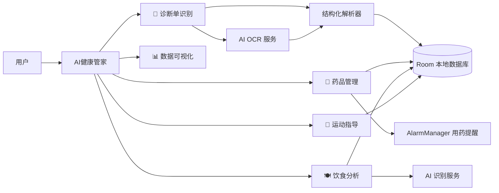

<div align="center">

# 🏆 AI健康管家 · AIHealth

**个人全流程 AI 健康管理平台**

[**中文**](README.md) · [English](README.en.md) · [日本語](README.ja.md)

---

[](#)


</div>

---

> 🏅 **中国机器人及人工智能大赛国奖项目** —— 面向真实健康管理场景打造的 AI 竞赛级作品

**AI健康管家（AIHealth）** 是一款以 AI 为核心、覆盖「记录 — 分析 — 提醒 — 指导」全流程的 Android 健康管理应用。它把复杂的医疗信息、用药计划、饮食摄入和运动方案，浓缩进一个流畅的原生应用，让健康管理真正「看得见、管得住、有反馈」。

## ✨ 项目亮点

| 亮点 | 说明 |
| --- | --- |
| 🏆 竞赛级品质 | **中国机器人及人工智能大赛国奖项目**，AI 落地医疗健康场景的代表作 |
| 🤖 AI 全链路赋能 | 统一 AI 调用接口（OCR + 菜品识别）+ 结构化解析，从图像到结构化健康数据一键完成 |
| 🧩 五大核心模块 | 诊断、用药、饮食、运动、可视化，覆盖健康管理全场景 |
| 🔒 数据本地化 | Room 数据库 + 本地账号体系，健康数据不出端，隐私有保障 |
| ⚡ 轻量高效 | Java 原生 + 主流开源组件，无重型框架负担，启动快、易维护 |

## 🧩 核心功能

| 模块 | 核心能力 |
| --- | --- |
| 📄 **诊断单智能识别** | 拍照/相册导入 → AI OCR 识别 → 自动解析诊断结论、医嘱、过敏提示及关键指标（血压、血糖、心率、血脂、BMI 等）；支持历史记录筛选、快速统计、图片预览 |
| 💊 **药品全周期管理** | 药品录入、每日次数、多时段服药提醒；已服/未服状态跟踪；批量编辑与提醒开关；AlarmManager 定时提醒，开机自动恢复 |
| 🍽️ **饮食智能分析** | 食物拍照 → AI 识别食材 → 热量与蛋白质/脂肪/碳水等营养估算；今日摄入统计、历史记录、结果分享 |
| 🏃 **个性化运动指导** | 8+ 运动类型 × 多级强度选择；结合时长与目标（减脂/增肌/健身）生成个性化建议与安全注意事项 |
| 📊 **健康数据可视化** | MPAndroidChart 柱状/折线/饼图；近 7 天诊断趋势、血糖趋势、用药状态分布；健康综合评分、周/月报告、数据导出 |
| 🔐 **账号系统** | 本地注册/登录，多数据库隔离（用户库、健康库、饮食库），登录态持久化 |

## 🛠️ 技术架构



### 技术栈一览

| 类别 | 技术选型 |
| --- | --- |
| 开发语言 | Java 11（source/target 11） |
| UI 框架 | Material Components、ConstraintLayout、DrawerLayout、BottomNavigationView、CardView |
| 本地存储 | Room 2.6（用户 / 诊断 / 药品 / 饮食 / 运动多库隔离） |
| 网络请求 | OkHttp 4.12、Retrofit 2.9、Gson 2.10 |
| AI 能力 | 通用 AI 调用接口（OCR / 图像识别，默认接入云端 AI 服务，服务商可按需替换） |
| 图表 | MPAndroidChart 3.1 |
| 提醒服务 | AlarmManager（精确闹钟）+ BroadcastReceiver + 通知渠道（开机恢复） |
| 图片加载 | Coil 2.5 |
| 构建工具 | Gradle（Kotlin DSL）+ Wrapper + Version Catalog，AGP 8.13.0，compileSdk 36 |

## 📂 项目结构

```text
AIHealth/
├── app/                            # Android 应用主模块
│   ├── libs/                       # 本地依赖（OCR SDK：ocrsdk.aar）
│   ├── schemas/                    # Room 数据库 Schema 导出
│   └── src/main/
│       ├── java/com/oppo/AIHealth/
│       │   ├── activity/           # 药品周期管理、提醒广播接收等
│       │   ├── data/               # Room 数据库、DAO、实体（User/Drug/Diagnosis/Diet/Sport）
│       │   ├── fragments/          # 五大功能模块页面
│       │   ├── model/              # 饮食记录、营养项等数据模型
│       │   ├── utils/              # AI 服务封装、OCR、诊断解析、权限工具
│       │   └── *.java              # 主 Activity、自定义相机、图表视图、登录注册等
│       └── res/                    # 布局 / 资源 / 主题 / 菜单
├── gradle/                         # Version Catalog 与 Wrapper
├── build.gradle.kts                # 根构建脚本
├── settings.gradle.kts             # 工程设置
└── local.properties.example        # 本地配置模板（sdk.dir / AI 服务密钥）
```

## 🚀 快速开始

### 环境要求

- Android Studio（最新稳定版即可）
- JDK 17
- Android SDK 36（minSdk 24 / targetSdk 36）

### 构建步骤

```bash
# 1. 克隆仓库
git clone https://github.com/Universe0121/AIHealth.git
cd AIHealth

# 2. 复制本地配置模板
cp local.properties.example local.properties
```

编辑 `local.properties`，填写 SDK 路径与 AI 服务密钥：

```properties
sdk.dir=C:\\Users\\YourName\\AppData\\Local\\Android\\Sdk

# AI 服务密钥（当前默认接入百度 AI，可在代码中替换为其他 AI 服务商）
BAIDU_API_KEY=your_baidu_api_key
BAIDU_SECRET_KEY=your_baidu_secret_key
```

使用 Android Studio 打开工程根目录，或命令行构建：

```powershell
.\gradlew.bat assembleDebug
```

APK 产物位于 `app/build/outputs/apk/debug/`，安装即可体验。

## 🔑 AI 调用接口配置说明

- **统一调用入口**：应用通过统一的 AI 调用接口完成 OCR 与图像识别，具体服务商可按需替换，当前默认接入百度 AI。
- **诊断单 OCR**：通过 AI 调用接口识别文字（默认实现：百度 OCR SDK `app/libs/ocrsdk.aar`，AK/SK 授权初始化）。
- **菜品识别**：通过 AI 调用接口识别食材（默认实现：百度 AI 菜品识别 REST API `aip.baidubce.com`）。
- **兜底机制**：未配置密钥或识别失败时，自动回退到内置模拟数据，保证演示流程不中断。

> ⚠️ `local.properties` 已被 `.gitignore` 忽略，请勿提交真实密钥，避免泄露。

## 📌 注意事项

- 构建产物、IDE 配置、本地 SDK 路径、日志、APK 等均已通过 `.gitignore` 排除，可放心提交源码。
- 所有数据保存在本地 Room 数据库，卸载应用或清除数据会丢失记录。
- 用药提醒依赖 AlarmManager，部分国产 ROM 需允许应用自启动/后台运行才能准时提醒。
- 本仓库当前未附带 LICENSE，默认保留所有权利，商用请先与维护者沟通。

## 🤝 参与贡献

欢迎通过 Issue / PR 参与贡献。提交前请确认：

- 代码风格与现有工程保持一致
- 不提交本地配置、密钥与构建产物
- 新功能附带必要的说明与测试

## 🙏 致谢

- 感谢 **中国机器人及人工智能大赛** 提供的竞赛平台与指导
- 感谢百度 AI 等开放平台提供的 OCR 与图像识别能力
- 感谢所有开源依赖作者与社区

---

<div align="center">

Made with ❤️ · **中国机器人及人工智能大赛国奖项目** · [English](README.en.md) · [日本語](README.ja.md)

</div>
